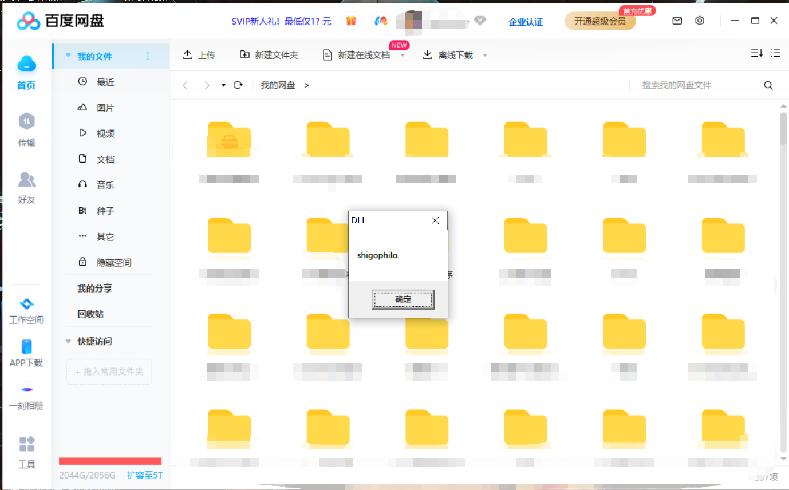

Untrusted search path vulnerability in Baidunetdisk Version 7.4.3 and earlier allows an attacker to gain privileges via a Trojan horse DLL in an unspecified directory.


The latest Baidunetdisk for windows pc client has a dll hijacking vulnerability
Baidunetdisk download address: https://pan.baidu.com/download

Runn `baidunetdisk.exe` will load 10 dll files
```
MFPlat.dll
RTWorkQ.DLL
msmpeg2vdec.dll
msvproc.dll
UMPDC.dll
dxgi.dll
d3d11.dll
dcomp.dll
D3DSCache.dll
midimap.dll
```
The attacker only needs to put the elaborate dll in the root directory of Baidunetdisk



